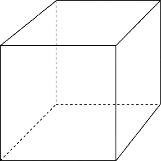
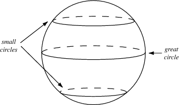
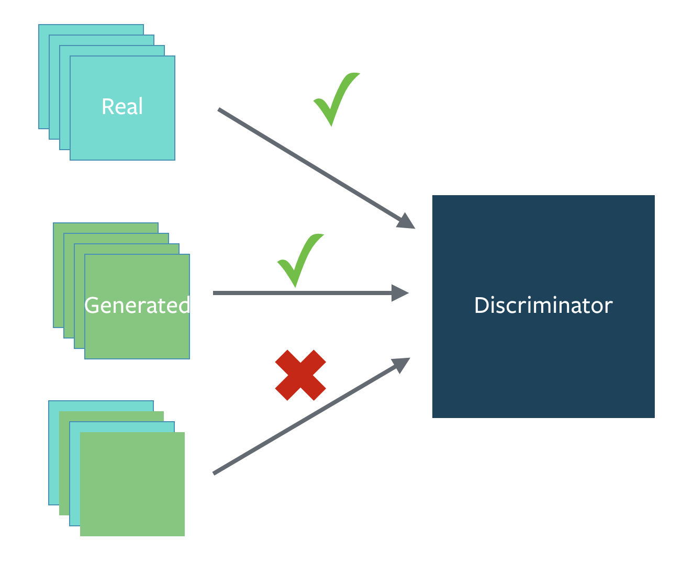

# How to Train a GAN? Tips and tricks to make GANs work

While research in Generative Adversarial Networks (GANs) continues to improve the
fundamental stability of these models,
we use a bunch of tricks to train them and make them stable day to day.

Here are a summary of some of the tricks.

[Here's a link to the authors of this document](#authors)

If you find a trick that is particularly useful in practice, please open a Pull Request to add it to the document.
If we find it to be reasonable and verified, we will merge it in.

## 1. Normalize the inputs

- normalize the images between -1 and 1
- Tanh as the last layer of the generator output

## 2: A modified loss function

In GAN papers, the loss function to optimize G is `min (log 1-D)`, but in practice folks practically use `max log D`
  - because the first formulation has vanishing gradients early on
  - Goodfellow et. al (2014)

In practice, works well:
  - Flip labels when training generator: real = fake, fake = real

## 3: Use a spherical Z
- Dont sample from a Uniform distribution



- Sample from a gaussian distribution



- When doing interpolations, do the interpolation via a great circle, rather than a straight line from point A to point B
- Tom White's [Sampling Generative Networks](https://arxiv.org/abs/1609.04468) ref code https://github.com/dribnet/plat has more details


## 4: BatchNorm

- Construct different mini-batches for real and fake, i.e. each mini-batch needs to contain only all real images or all generated images.
- when batchnorm is not an option use instance normalization (for each sample, subtract mean and divide by standard deviation).



## 5: Avoid Sparse Gradients: ReLU, MaxPool
- the stability of the GAN game suffers if you have sparse gradients
- LeakyReLU = good (in both G and D)
- For Downsampling, use: Average Pooling, Conv2d + stride
- For Upsampling, use: PixelShuffle, ConvTranspose2d + stride
  - PixelShuffle: https://arxiv.org/abs/1609.05158

## 6: Use Soft and Noisy Labels

- Label Smoothing, i.e. if you have two target labels: Real=1 and Fake=0, then for each incoming sample, if it is real, then replace the label with a random number between 0.7 and 1.2, and if it is a fake sample, replace it with 0.0 and 0.3 (for example).
  - Salimans et. al. 2016
- make the labels the noisy for the discriminator: occasionally flip the labels when training the discriminator

## 7: DCGAN / Hybrid Models

- Use DCGAN when you can. It works!
- if you cant use DCGANs and no model is stable, use a hybrid model :  KL + GAN or VAE + GAN

## 8: Use stability tricks from RL

- Experience Replay
  - Keep a replay buffer of past generations and occassionally show them
  - Keep checkpoints from the past of G and D and occassionaly swap them out for a few iterations
- All stability tricks that work for deep deterministic policy gradients
- See Pfau & Vinyals (2016)

## 9: Use the ADAM Optimizer

- optim.Adam rules!
  - See Radford et. al. 2015
- Use SGD for discriminator and ADAM for generator

## 10: Track failures early

- D loss goes to 0: failure mode
- check norms of gradients: if they are over 100 things are screwing up
- when things are working, D loss has low variance and goes down over time vs having huge variance and spiking
- if loss of generator steadily decreases, then it's fooling D with garbage (says martin)

## 11: Dont balance loss via statistics (unless you have a good reason to)

- Dont try to find a (number of G / number of D) schedule to uncollapse training
- It's hard and we've all tried it.
- If you do try it, have a principled approach to it, rather than intuition

For example
```
while lossD > A:
  train D
while lossG > B:
  train G
```

## 12: If you have labels, use them

- if you have labels available, training the discriminator to also classify the samples: auxillary GANs

## 13: Add noise to inputs, decay over time

- Add some artificial noise to inputs to D (Arjovsky et. al., Huszar, 2016)
  - http://www.inference.vc/instance-noise-a-trick-for-stabilising-gan-training/
  - https://openreview.net/forum?id=Hk4_qw5xe
- adding gaussian noise to every layer of generator (Zhao et. al. EBGAN)
  - Improved GANs: OpenAI code also has it (commented out)

## 14: [notsure] Train discriminator more (sometimes)

- especially when you have noise
- hard to find a schedule of number of D iterations vs G iterations

## 15: [notsure] Batch Discrimination

- Mixed results

## 16: Discrete variables in Conditional GANs

- Use an Embedding layer
- Add as additional channels to images
- Keep embedding dimensionality low and upsample to match image channel size

## 17: Use Dropouts in G in both train and test phase
- Provide noise in the form of dropout (50%).
- Apply on several layers of our generator at both training and test time
- https://arxiv.org/pdf/1611.07004v1.pdf

## 18: For VAEs: Use Focal Loss as Reconstruction Error
- Greedy pretraining: use MSE loss at high learning rate (~0.01) for few epochs until output appears to be in the right "ballpark"; Tanh activation output layer; images scaled \[-1,1\]
- Subsequently, scale images between \[0,1\], loading the saved weights from greedy pretraining phase, use Sigmoid activation function in output layer and Focal loss as reconstruction error at a very low learning rate (1e-6 or less)
- See custom Tensorflow loss functions [in Python with link to paper on arXiv](https://github.com/umbertogriffo/focal-loss-keras) and [in R](https://gist.github.com/PsycheShaman/ea39081d9f549ac410a3a8ea942a072b)


## Authors
- Soumith Chintala
- Emily Denton
- Martin Arjovsky
- Michael Mathieu
